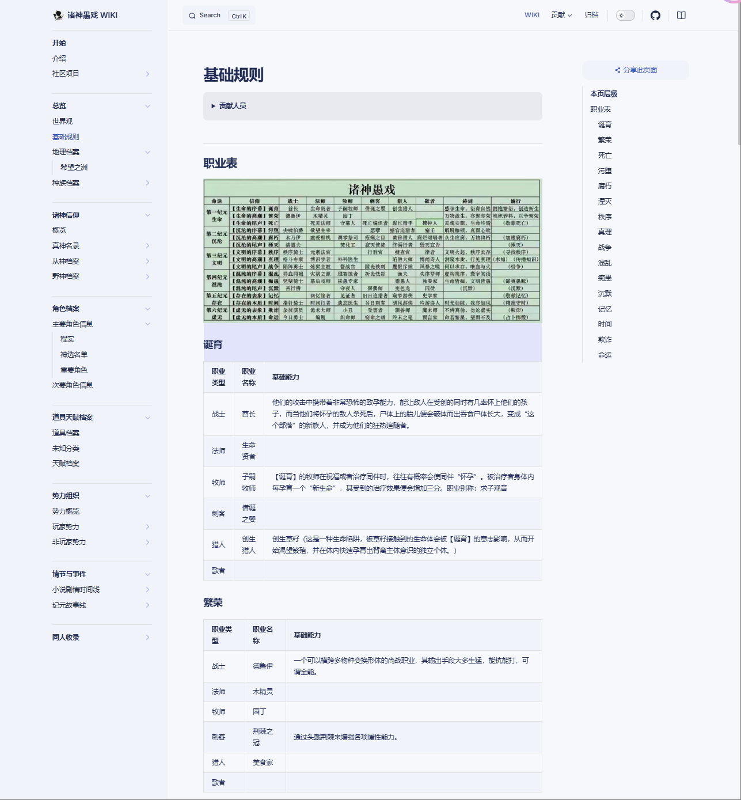

<p align="center"><h2>诸神愚戏 WIKI</h2></p>

------------------------------

## 许可

本文档所有**原创内容**遵从 [CC BY-NC-ND 4.0](https://creativecommons.org/licenses/by-nc-nd/4.0/deed.zh-hans) 协议 


本WIKI内容 基于 番茄小说平台 [@一月九十秋](#) 连载的《诸神愚戏》小说

## 欢迎来到《诸神愚戏》WIKI！

这里是致力于收录和整理小说《诸神愚戏》相关内容的百科全书。

无论是小说中的人物、事件、地点，还是神话设定、世界观细节，

你都可以在这里找到详细的资料和信息。

本WIKI旨在为读者提供关于《诸神愚戏》小说的完整资料和深入分析，

帮助读者更好地理解小说中的复杂设定和人物关系。

无论是想了解相关内容，或者创作同人，本WIKI都将是你最好的参考资源。


## 个人部署经验

https://github.com/Mueoink/zsyx-wiki

powershell 里面跑
```
conda deactivate
cd C:\Users\13613\Desktop\zsyx\zsyx-wiki
pnpm install
pnpm docs:dev
```
pnpm docs:build 本地不需要运行这行 没有用 或者如果要的话 运行
```
pnpm docs:build 
pnpm docs:preview
```

### 一些经验
1. 构建方面 初始需要
	1. workflows这个完全不需要改 其实就是我自己本地跑build会出来的内容 但是注意 因为本地的地址和网上的不同 所以本地直接打开html肯定是链接不到，所以本地就是用dev就行，正确纠正的方式就是`docs/.vitepress/config.mjs`中需要加的一个
```
export default defineConfig({
// 原来大小写也是重要的 我真没招了
  base: '/Zhushenyuxi/',
```
2. 文件中docs/wiki下是所有自己要写的md文本 具体版面格式见`docs/.vitepress/config.mjs`里面设置了左边的目录。
3. 注意所有图片放在public下面 docs\public\profession\profession.jpg
引用的时候像下面这样引用
```
<script setup>
import { withBase } from 'vitepress'
const galleryImages = [
  { src: withBase('/profession/profession.jpg'), text: 'by:零玲' },
];
</script>

## 1
<div v-for="(item, index) in galleryImages" :key="index">
  
</div>

```

### 整体效果

